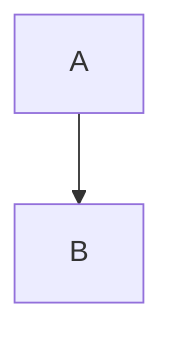

# OEDIPUS: TIME AND STRUCTURE IN NARRATIVE FORM

- _Terence S. Turner University of Chicago_

## I. Introduction

The story of Oedipus is among the most prominent and persistent tales in the lore of Western Civilization, from the earliest Greek times to Freud and Cocteau. Most recently, in the hands of Levi-Strauss and Leach, the Oedipus story has become the prototype of the structuralist analysis of myth and other forms of oral narra-tive. The analysis of the tale presented in this paper is intended as a partial reformulation and extension of the structuralist ap-proach. Its major difference from earlier structuralist treatments of myth is that it lays great emphasis on the temporal structure of the narrative as well as the logical structure of relations between its component elements. On the basis of a re-examination of the nature and significance of narrative structure, a set of general propositions concerning the functions of narrative forms as cultural models is proposed. A reanalysis of the tale of Oedipus is offered as an illustration of this set of propositions. 

## II. Levi-Strauss' Analysis of the Oedipus Story in Relation to the "Structural Study of Myth"

Before going on to my own analysis, I should like briefly to review Levi-Strauss' treatment of the Oedipus story and to raise certain questions with regard to it. It cannot be emphasized too strongly that Levi-Strauss' study of the tale of Oedipus represents only his first experiment in myth analysis. It would be ludicrous to use it as an example of Levi-Strauss' total oeuvre or current position in the field of myth analysis. It nevertheless remains true that "The Structural Study of Myth," in which the Oedipus analysis appeared, has attracted far wider attention in English speaking countries than any of Levi-Strauss' other works on myth, which have for the most part remained untranslated, at least until the last few years. Partly for this reason, and partly because in it Levi-Strauss dealt with certain general problems of theory and method which he has not explicitly treated since, this article, and the Oedipus analysis which has been taken as its chef d'oeuvre, have been widely received as definitive formulations oTrgvi-Strauss' (or at any rate the "structuralist") position. A careful re-examination of this pioneering study may therefore have considerable value in the context of the current discussion of "structuralism." Levi-Strauss prefaces his analysis of the tale of Oedipus with a brilliant statement of the essential characteristics of myth, in which he makes three basic points. First, the meaning of myth resides, not in its isolated symbolic elements, and not even in isolated relations between these elements, but in "bundles" or com-binations of such relations. Second, there are two analytically distinct aspects of the presentation of these "bundles" in a myth, the difference between which is their mode of temporal extension. One aspect is analogous to the "langue" of Saussurian linguistics: its time is reversible, "mechanical," or synchronic. The other is analogous to parole: its time is irreversible, "statistical," dia-chronic. The third point Levi-Strauss makes is that the unique and essential characteristic of myth is that it combines or fuses these two aspects of temporal extension. Levi-Strauss describes this fu-sion with keen insight: On the one hand, a myth always refers to events alleged to have taken place in time: before the world was created, or during its first stages - anyway, long ago. But what gives the myth an operative value is that the specific pattern described is everlasting; it ex-plains the present and the past as well as the future (1965:85). Myth, in other words, purports to be at once ...a non-reversible series of events...belonging to the past...and an everlasting pattern which can be detected in the present...social structure and which provides a clue for its interpretation...(1965:85). The structural locus of this fusion of the synchronic and the diachronic is not to be found, Levi-Strauss insists, ...in its style, its original music, or its syntax, but in the story which it tells (1965:86; author's italics). The central problem in the analysis of myth therefore becomes to lay bare the nature of the relationship of synchronic and dia-chronic factors in the story or narrative pattern of the myth. Levi-Strauss' analysis of the Oedipus myth is offered as a model for this procedure. As he formulates his approach, Relations pertaining to the same bundle may appear diachronically at remote intervals, but when we have succeeded in grouping them together, we have reorganized our myth according to a time referent of a new nature corresponding to the prerequisite of the initial hypo-thesis [i.e. that myth is a unique form of story that combines the two temporal modes of synchrony and dia-chrony], namely, a two-dimensional time referent which is simultaneously diachronic and synchronic and which accordingly integrates the characteristics of the langue  on one hand, and those of the parole on the other (1965: 87). The analysis of the Oedipus cycle Levi-Strauss generates on the basis of these assumptions must be regarded as one of the decisive moments in the development of modern anthropological thought. After decades of declining anthropological interest in myth in the face of the tautologies and exhausted problems of the Freudians and func-tionalists, not to mention the taxonomic sterility of the folklor-ists, Levi-Strauss boldly pointed to the possibility of generating a new type of analysis and a whole new set of problems out of the very features of myth that had been dismissed as insignificant by 

